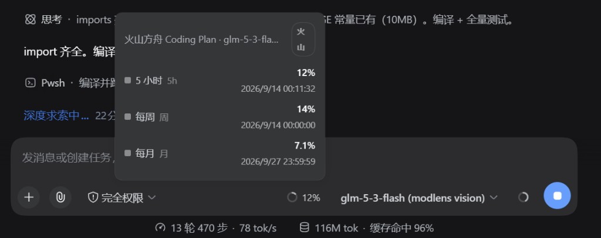
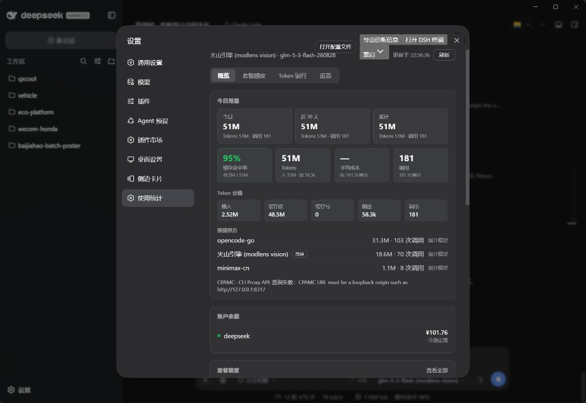

# dsh-usage-plus

[中文](README.zh.md) | English

Independent DSH usage and official Plan-quota plugin (Host + Web UI). Requires **DSH ≥ 0.1.7-rc.1**.

- Reuses credentials already configured for DSH model providers.
- Shows real 5-hour, weekly, and monthly windows on `conversation.composer.dock` (alongside StatsPills / ContextMeter).
- Renders nothing when a provider exposes no official quota window.
- Keeps CPAMC and Volcano Ark as separate sources (Plugins page → Settings).
- Overview includes a full 26-week Mon–Sun activity heatmap (ledger default 182 days).
- Keeps all secrets in the host process / credential vault.

## Screenshots

### Composer plan strip (current model)



When the active model matches an official plan source, the composer dock shows real 5-hour / weekly / monthly windows. Hover for reset times and the source chip (for example Volcano). Nothing is rendered when the remote API exposes no official window.

### Plugins → Usage · Overview



The overview summarizes today and the last 30 days, cache hit rate, token buckets, and per-provider totals. The balance card only lists real balances. Plan quotas and external sources live on the other tabs of the same Plugins page.

## Install

Install into a DSH profile with the official plugin command (adds the dependency and appends the package to `dsh.profile.bundles` so `cordis.patch.yml` is applied):

```bash
dsh plugin --profile desktop add ./
# or from npm / Git:
# dsh plugin --profile desktop add dsh-usage-plus
```

The package ships its own bundle patch (`id: usage-plus`, `name: dsh-usage-plus`).
If the older `@linxin666/dsh-usage` / `web-ui-usage` row is also present, disable it
in the profile patch to avoid duplicate UI.

Optional credential names are `CPAMC_MANAGEMENT_KEY`, `VOLC_ACCESSKEY`, and `VOLC_SECRETKEY`. Enable the matching source under **Plugins → Usage Statistics → Settings**, then **Save**. Leaving the page discards an unsaved draft (official `plugins.item` contract).

## Model Experience

- Quota strip follows the **session** `modelSelection` projection (composer picker / `/model`). It does not fall through to another session’s or the global plan while this session already has a route.
- Windows are only shown when the remote Plan API returns real percentages; there is no local token estimate disguised as quota.
- Token ledger and balance cards stay on the Plugins page; they do not inject into the conversation transcript.

## Known Limitations

- Requires DSH Desktop / Harness **≥ 0.1.7-rc.1** (`configForms`, volatile Config, `plugins.item`, `conversation.composer.dock`).
- Providers without an official Plan API show no strip and no fabricated windows.
- CPAMC accepts loopback origins (or hosts listed in `cpamcAllowedHosts`) only; management routes are read-only and reject redirects.
- Volcano Ark needs vaulted AK/SK (or `VOLC_ACCESSKEY` / `VOLC_SECRETKEY`); signing runs only in the Host process.
- Floating pet bubble announcements need a separate pet service in the profile; `bubbleMode: off` disables them.

## Accuracy

Plan UI and the composer strip only display windows returned by official remote APIs. Missing Plan API, missing percentages, or probe failures are never replaced with local estimates.

## License

Based on `@linxin666/dsh-usage` (Apache-2.0). CPAMC security constraints and Volcano signing behavior reference `dsh-cost-meter` (MIT). See [LICENSE](LICENSE).
